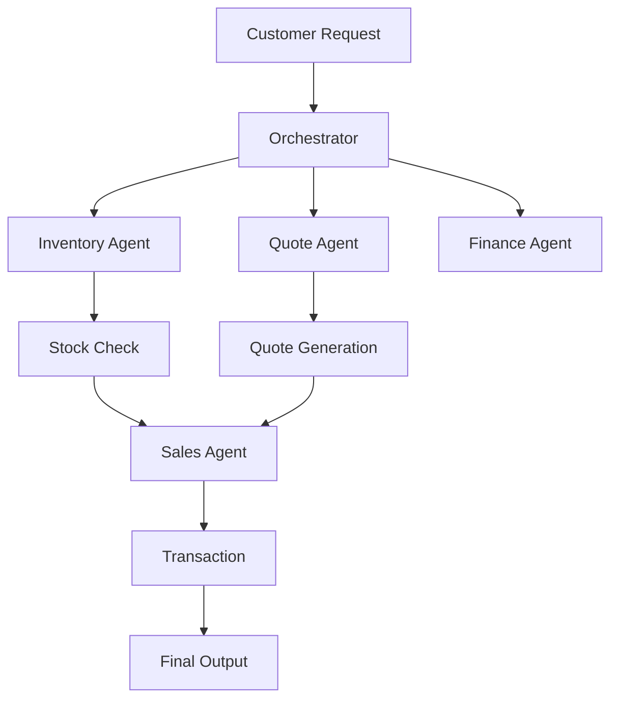

# beavers-choice-agents

# 🦫 Beaver's Choice Paper Company – Multi-Agent System

## 📌 Overview

This project implements a **multi-agent system** to optimize:

* Inventory management
* Quote generation
* Sales transactions

The system uses **5 agents** to automate business operations efficiently.

---

## 🤖 Agents

| Agent           | Role                   |
| --------------- | ---------------------- |
| Orchestrator    | Controls workflow      |
| Inventory Agent | Checks stock & reorder |
| Quote Agent     | Generates pricing      |
| Sales Agent     | Processes transactions |
| Finance Agent   | Tracks financials      |

---

## 🔄 Workflow



---

## ⚙️ Setup

```bash
pip install -r requirements.txt
pip install smolagents
```

Create `.env`:

```
UDACITY_OPENAI_API_KEY=your_key_here
```

---

## ▶️ Run

```bash
python beaver_agents.py
```

---

## 🧪 Testing

Uses:

```
quote_requests_sample.csv
```

Generates:

```
test_results.csv
```

---

## 📊 Features

✔ Multi-agent architecture
✔ Inventory tracking
✔ Smart quoting
✔ Automated transactions
✔ Financial reporting

---

## 🚀 Future Improvements

* Dynamic pricing model
* Supplier optimization
* Customer negotiation agent

---

## 👩‍💻 Author

Krishnapriya Sivakumar
